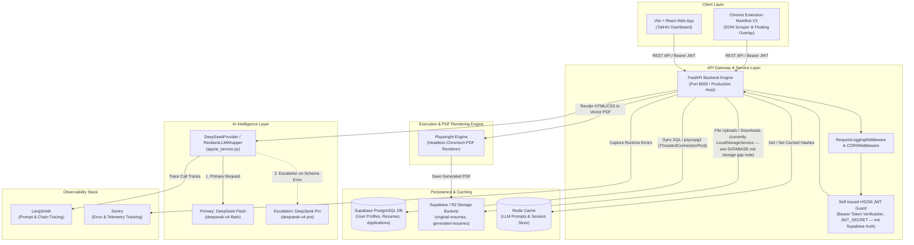
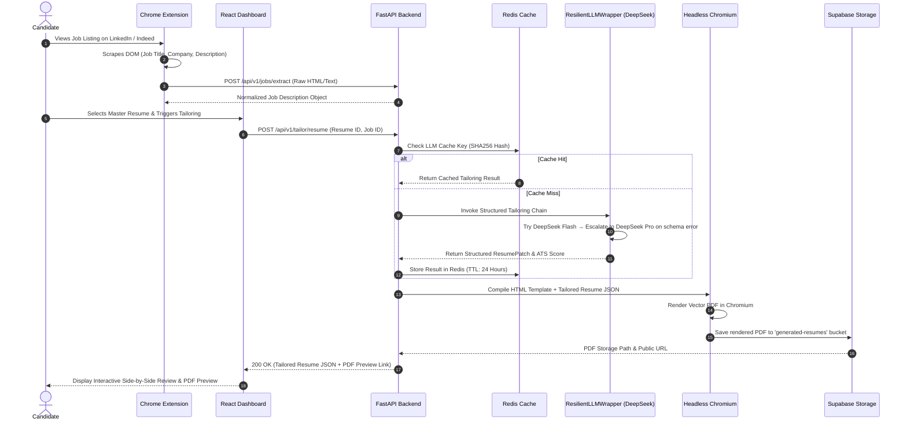

# Tailr4U - System Architecture & Data Flow Specification

This document details the high-level system architecture, service communication patterns, asynchronous processing flows, and modular component designs of **Tailr4U**.

---

## 1. High-Level System Architecture Diagram

---

## 2. End-to-End Execution Flow

### 2.1 Job Extraction & Instant Tailoring Sequence

---

## 3. Sub-System Architectural Breakdowns

### 3.1 Browser Intelligence Engine (Chrome Extension)
> Corrected from an earlier draft — see the status note at the top of [BROWSER_INTELLIGENCE_ARCHITECTURE.md](file:///e:/PICTURES/OneDrive/Desktop/chrome-extension/docs/BROWSER_INTELLIGENCE_ARCHITECTURE.md) for the full detail.
- **Manifest Version**: V3, `sidePanel` model (`frontend/public/manifest.json`) — no `content_scripts` entry. There is no injected floating overlay on job board pages; the entire UI runs in the Chrome side panel.
- **Extraction**: A single generic, site-agnostic heuristic collector — no per-site parser files (`linkedin.js`, `indeed.js`, etc. do not exist). The side panel calls `chrome.scripting.executeScript` with an inline function (`frontend/src/services/jdExtractionFlow.js::captureActiveTabJobEvidence`) that scores candidate DOM containers by job-related text signals, JSON-LD `JobPosting` presence, and known top-card selectors (LinkedIn-specific, with a generic fallback for other sites).
- **Background Service Worker** (`frontend/public/background.js`): Sets side-panel-on-click behavior and relays a couple of runtime messages. It does not do DOM scraping or OAuth token relay.

**Repository note**: `frontend/src/browser-intelligence/` (empty directories) and `frontend/public/content_snapshot.js` were an earlier, unused iteration of this collector — superseded by the inline collector above.

### 3.2 FastAPI Enterprise Engine Architecture
The backend follows a 4-layer Clean Architecture pattern:
1. **API Layer (`api/v1/`)**: Versioned HTTP controllers responsible for request validation (`Pydantic`), CORS, and status codes.
2. **Service Layer (`services/` & `app/`)**: Encapsulates business logic, AI prompt compilation, rate limiting, and multi-model failover mechanisms.
3. **Repository Layer (`repositories/`)**: Abstracted database access layer executing SQL queries over connection pools (`asyncpg` / `psycopg2`).
4. **Core Layer (`core/`)**: System configuration (`Pydantic BaseSettings`), security middleware, database pool management, and observability tracing setup.

### 3.3 Multi-Model Resilient AI Pipeline (`ResilientLLMWrapper`)
To guarantee 99.9% uptime and handle transient API errors:
- **Thread Safety**: Single-request execution lock (`_SINGLE_AI_REQUEST_LOCK`) enforcing a mandatory minimum spacing (`1.5s`) between consecutive model invocations.
- **Provider**: DeepSeek via OpenAI-compatible SDK (`https://api.deepseek.com`).
- **Failover Hierarchy**:
  1. **DeepSeek Flash (`deepseek-v4-flash`)**: Ultra-fast primary model for JSON structured outputs.
  2. **DeepSeek Pro (`deepseek-v4-pro`)**: High-intelligence escalation model triggered automatically on Flash schema validation failure.

### 3.4 Headless Chromium Playwright PDF Engine
- PDF generation does not rely on fragile client-side html2pdf libraries.
- The backend maintains an internal static render route (`/__pdf_renderer`) loading built React templates.
- **Playwright Execution**:
  1. Boots isolated Chromium browser context (`headless=True`).
  2. Injects tailored resume JSON data into template DOM.
  3. Evaluates page dimensions, applies CSS print styles (`@media print`), and renders a pixel-perfect PDF vector buffer.
  4. Uploads PDF directly to `generated-resumes` bucket and returns download link.

---

## 4. Observability & Tracing Architecture

- **LangSmith Tracing**: Every call through `ResilientLLMWrapper` reports token consumption, execution latency, and exact prompt/response payloads to LangSmith.
- **Request Logging Middleware**: Generates structured logs containing HTTP Method, Path, Status Code, Execution Time (ms), and Client IP.
- **Sentry Integration**: Captures unhandled runtime exceptions and database connection failures with full stack traces.
