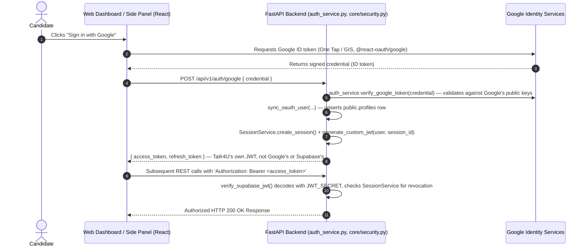

# Tailr4U - Custom Auth & Google Sign-In Specification

> ⚠️ **Corrected**: this document previously described a Supabase Auth OAuth 2.0 PKCE redirect flow. That is not what's implemented. Auth is fully custom (bcrypt password hashing + self-issued JWTs), and Google sign-in verifies a Google Identity Services credential directly server-side — no Supabase Auth or PKCE redirect involved. See [SECURITY.md](file:///e:/PICTURES/OneDrive/Desktop/chrome-extension/docs/SECURITY.md) §1 for the full corrected auth architecture.

This document details the identity management architecture, Google Sign-In verification, Bearer JWT session handling, and Chrome Extension session storage for **Tailr4U**.

---

## 1. Authentication Architecture & Identity Overview

Tailr4U owns its full identity stack: `AuthService` + `core/security.py` handle password hashing (`bcrypt`, 12 rounds) and JWT issuance/verification (`JWT_SECRET`, HS256). Google Sign-In is verified directly against Google — not proxied through Supabase.



Email/password login (`POST /api/v1/auth/register`, `POST /api/v1/auth/login`) follows the same session-issuance path minus the Google credential step — see `backend/api/v1/auth.py:144` and `:260`.

---

## 2. Token Standards & Claims Protocol

### 2.1 Access Token Structure (JWT)
- **Algorithm**: `HS256` only (single shared `JWT_SECRET`, not RS256/asymmetric).
- **Key Claims** (`core/security.py:43-55`):
  - `sub`: User ID UUID (maps to `public.profiles.id` — there is no `auth.users` Supabase table involved in production; the local dev seed script creates a mock `auth.users` row purely for FK compatibility)
  - `email`: Candidate email address
  - `jti`: Session ID, checked against `SessionService` on every request so a session can be revoked server-side before token expiry
  - `exp`: Expiration timestamp (`JWT_EXPIRE_MINUTES`, default 30 minutes — not 1 hour)

---

## 3. Chrome Extension Session Storage

The Chrome extension is a `sidePanel`-type Manifest V3 extension — the side panel loads the *same* React web app, not a separate extension-only UI. There is no cross-context message-passing bridge; `storeAuthenticatedSession()` (`frontend/src/services/authSession.js:15`) simply writes the token to both storages directly, whichever are available in the current execution context:
```javascript
localStorage.setItem(AUTH_STORAGE.accessToken, accessToken);
if (typeof chrome !== 'undefined' && chrome.storage?.local) {
  chrome.storage.local.set({ access_token: accessToken, refresh_token: refreshToken });
}
```
`installAuthenticatedFetch()` (same file) monkey-patches `window.fetch` to attach the stored `Authorization: Bearer` header to same-origin API calls and transparently retries once via `POST /api/v1/auth/refresh` on a `401`.
