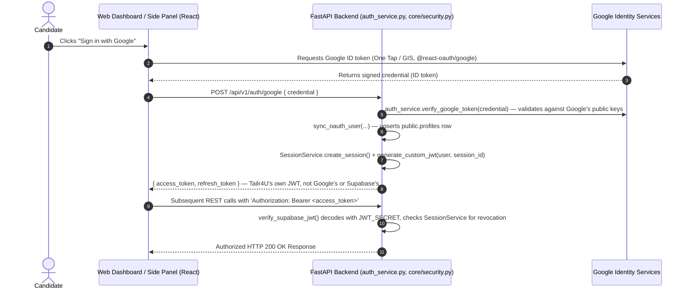

# Tailr4U - Custom Auth & Google Sign-In Specification

> ⚠️ **Corrected**: this document previously described a Supabase Auth OAuth 2.0 PKCE redirect flow. That is not what's implemented. Auth is fully custom (bcrypt password hashing + self-issued JWTs), and Google sign-in verifies a Google Identity Services credential directly server-side — no Supabase Auth or PKCE redirect involved. See [SECURITY.md](file:///e:/PICTURES/OneDrive/Desktop/chrome-extension/docs/SECURITY.md) §1 for the full corrected auth architecture.

This document details the identity management architecture, Google Sign-In verification, Bearer JWT session handling, and Chrome Extension session storage for **Tailr4U**.

---

## 1. Authentication Architecture & Identity Overview

Tailr4U owns its full identity stack: `AuthService` + `core/security.py` handle password hashing (`bcrypt`, 12 rounds) and JWT issuance/verification (`JWT_SECRET`, HS256). Google Sign-In is verified directly against Google — not proxied through Supabase.



Email/password login (`POST /api/v1/auth/register`, `POST /api/v1/auth/login`) follows the same session-issuance path minus the Google credential step — see `backend/api/v1/auth.py:144` and `:260`.

---

## 2. Token Standards & Claims Protocol

### 2.1 Access Token Structure (JWT)
- **Algorithm**: `HS256` only (single shared `JWT_SECRET`, not RS256/asymmetric).
- **Key Claims** (`core/security.py:43-55`):
  - `sub`: User ID UUID (maps to `public.profiles.id` — there is no `auth.users` Supabase table involved in production; the local dev seed script creates a mock `auth.users` row purely for FK compatibility)
  - `email`: Candidate email address
  - `jti`: Session ID, checked against `SessionService` on every request so a session can be revoked server-side before token expiry
  - `exp`: Expiration timestamp (`JWT_EXPIRE_MINUTES`, default 30 minutes — not 1 hour)

---

## 3. Chrome Extension Session Storage

The Chrome extension is a `sidePanel`-type Manifest V3 extension — the side panel loads the *same* React web app, not a separate extension-only UI. There is no cross-context message-passing bridge; `storeAuthenticatedSession()` (`frontend/src/services/authSession.js:15`) simply writes the token to both storages directly, whichever are available in the current execution context:
```javascript
localStorage.setItem(AUTH_STORAGE.accessToken, accessToken);
if (typeof chrome !== 'undefined' && chrome.storage?.local) {
  chrome.storage.local.set({ access_token: accessToken, refresh_token: refreshToken });
}
```
`installAuthenticatedFetch()` (same file) monkey-patches `window.fetch` to attach the stored `Authorization: Bearer` header to same-origin API calls and transparently retries once via `POST /api/v1/auth/refresh` on a `401`.

---

## 4. New-Tab Session Handoff & Verification Resilience

Clicking "Resume" / "Cover Letter" in the extension panel (`components/JobReviewView.jsx::openWorkflowRoute`) opens a **new tab pointing at the extension's own bundled page** — `chrome.runtime.getURL('index.html#/tailor-config')` via `chrome.tabs.create` — not an externally hosted site. Because the new tab is the same `chrome-extension://<id>` origin as the panel, `localStorage` (written synchronously just before the tab opens) is already visible to it; `chrome.storage.local` is written as a backup/secondary path. No token/session query param or `postMessage` handoff is needed or used for this flow.

### 4.1 Session Restoration on Mount (`context/AppContext.jsx::checkSession`)
Every mounted instance (side panel, or any newly opened tab) runs its own `checkSession()` on mount:
1. **Instant unblock**: if both a stored `access_token` AND a cached `user` object are found (`localStorage`, falling back to `chrome.storage.local`), the UI renders as logged-in immediately (`<10ms`), before any network call.
2. **Background verification**: regardless of the instant-unblock outcome, a `GET /api/v1/auth/session` call runs to confirm the token server-side. It retries up to 3 times (8s timeout each, with backoff) before giving up — sized generously because a cold-starting Render backend instance can take well over 10-20s to respond, and a short budget here reads a merely-slow backend as "logged out."
3. **Confirmed `401`**: attempts a token refresh (`refreshAccessToken()`) before falling back to actually clearing the session (`localStorage.removeItem('access_token'/'refresh_token')`, `setUser(null)`, `setSession(null)`). As of 2026-08-04, `refreshAccessToken()` itself retries transient failures (network error, timeout, 5xx) up to 3 times with backoff and an 8s per-attempt timeout before giving up — previously it made exactly one unbounded attempt, so a single slow/cold-backend response on this specific call was enough to log the user out even with a perfectly valid refresh token. It still gives up immediately on a definitive `401`/`403` (the refresh token itself was rejected).

### 4.3 Server-Side: Surviving a Concurrent Refresh Race Between Two Tabs
Because the side panel and any tab opened from it share one session (same access/refresh tokens via `localStorage`), both can independently notice the same access token expiring and call `POST /auth/refresh` at nearly the same moment. `SessionService.rotate_refresh_token` stores exactly one `refresh_token_hash` per session, atomically replaced on each rotation — so whichever request the database processes first wins, and the other's refresh token is stale by the time it's looked up (a timing race, not an invalid session). As of 2026-08-04, the endpoint's fallback for this case verifies the losing request's old access token by signature only (`jwt.decode(..., options={"verify_exp": False})` — the token's `exp` has, by definition, already passed) and independently confirms the session is still live via `SessionService.is_session_refreshable()` (not revoked, refresh window not expired) before issuing it a fresh token pair too. Previously this fallback re-ran the strict `verify_supabase_jwt()`, which enforces `exp` and therefore almost always failed for exactly the token it was being asked to rescue — permanently logging out the losing tab (see [KNOWN_ISSUES.md](KNOWN_ISSUES.md) ISSUE-011).
4. **Inconclusive result** (network error, timeout, non-401 5xx — i.e. we simply couldn't confirm either way): the session is left exactly as-is. It must **never** be treated as a logout here — see the gotcha below.

### 4.2 Gotcha: `setUser(null)` Deletes Storage, Not Just React State
`setUser()` is a wrapper (not the raw `useState` setter): calling it with a real object writes `user` to both `localStorage` and `chrome.storage.local`; calling it with `null` **deletes** `user` from both. This makes it strictly more destructive than it looks at the call site — using it to represent "couldn't confirm this cycle" silently and permanently destroys the cached profile, which then makes every future tab's "instant unblock" (§4.1 step 1) fail until a live verification call happens to succeed, since that check requires both a stored token AND a stored user. This exact chain caused new tabs opened via "Resume"/"Cover Letter" to land on `/extension-setup` despite a fully valid token (see [KNOWN_ISSUES.md](KNOWN_ISSUES.md) ISSUE-007, resolved 2026-08-04). Only call `setUser(null)` for an actually-confirmed invalid session, never for "the check was inconclusive."
