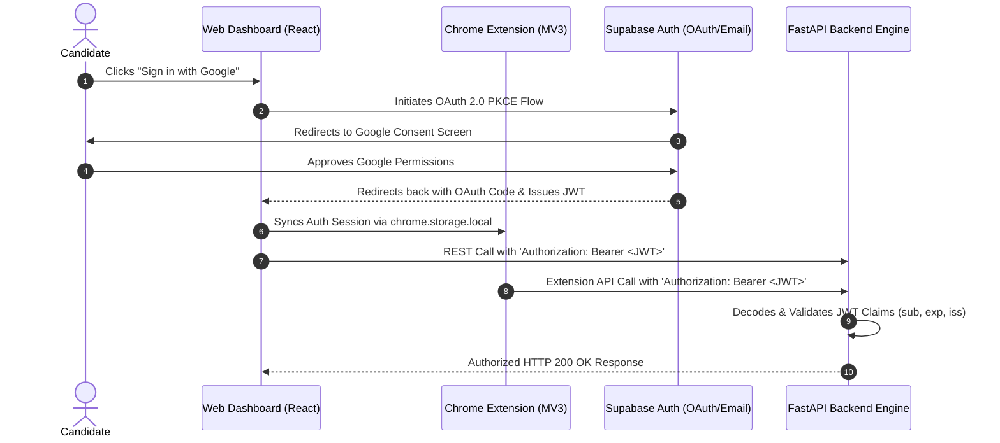

# Tailr4U - Supabase Auth & Google OAuth Specification

This document details the identity management architecture, Supabase Auth integration, Google OAuth 2.0 PKCE flow, Bearer JWT session synchronization, and Chrome Extension authentication bridge for **Tailr4U**.

---

## 1. Authentication Architecture & Identity Overview

Tailr4U delegates user identity, password hashing (Bcrypt/Argon2), and OAuth provider token exchanges to **Supabase Auth**.



---

## 2. Token Standards & Claims Protocol

### 2.1 Access Token Structure (JWT)
- **Algorithm**: `HS256` / `RS256`
- **Key Claims**:
  - `sub`: User ID UUID (maps directly to `auth.users.id` and `public.profiles.id`)
  - `email`: Candidate email address
  - `role`: `authenticated`
  - `exp`: Expiration timestamp (Default: 3600 seconds / 1 hour)

---

## 3. Chrome Extension Token Synchronization Bridge

To provide seamless single sign-on (SSO) between the web dashboard and the Chrome Extension:
1. When a user logs into the web dashboard at `app.tailr4u.com`, the React Auth Context posts a message to the Chrome Extension background service worker:
   ```javascript
   chrome.runtime.sendMessage(EXTENSION_ID, {
     type: "SYNC_AUTH_SESSION",
     session: { access_token, refresh_token, user }
   });
   ```
2. The Extension background worker persists the session tokens in `chrome.storage.local`.
3. Injected content scripts read the token from extension storage and append `Authorization: Bearer <access_token>` to all background REST requests.
