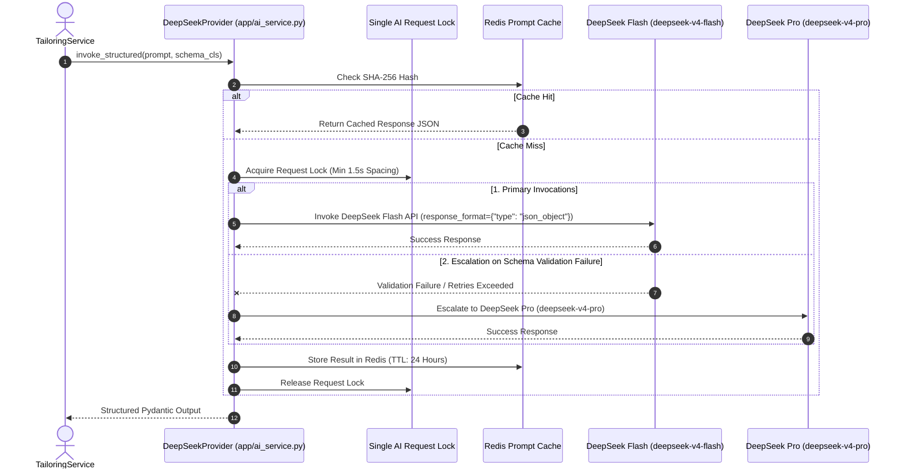

# Tailr4U - Backend Architecture & Engine Specification

This document provides a comprehensive technical breakdown of the **Tailr4U Backend Engine (`v3.0.0`)**, its 4-Layer Clean Architecture, database connection pool management, resilient multi-model AI pipeline, Playwright PDF rendering engine, and middleware stack.

---

## 1. Backend Architecture & Design Philosophy

The Tailr4U backend is an enterprise-grade, asynchronous REST API engine built with **Python 3.12** and **FastAPI**. It enforces a strict **4-Layer Clean Architecture** pattern to guarantee total separation of concerns, high testability, and decoupled maintainability.

```mermaid
graph TD
    subgraph Client Layer
        CLIENT["Web Dashboard / Chrome Extension"]
    end

    subgraph Layer 1: API Router Layer (api/v1/)
        ROUTERS["HTTP Controllers & Request Validation<br/>(auth.py, resume.py, tailoring.py, etc.)"]
        DEPENDENCIES["Dependency Injection<br/>(get_current_user, get_db_connection)"]
    end

    subgraph Layer 2: Business Service Layer (services/ & app/)
        SERVICES["Business Logic & Workflow Services<br/>(TailoringService, JobService)"]
        AI_WRAPPER["ResilientLLMWrapper<br/>(DeepSeek Flash → Pro Escalation)"]
        PLAYWRIGHT_ENGINE["Playwright PDF Rendering Engine<br/>(Headless Chromium Vector PDF Pipeline)"]
    end

    subgraph Layer 3: Repository Access Layer (repositories/)
        REPOS["Abstracted Data Repositories<br/>(ProfileRepo, ResumeRepo, ApplicationRepo)"]
    end

    subgraph Layer 4: System Engine Core (core/)
        DB_POOL["ThreadedConnectionPool Singleton<br/>(minconn=10, maxconn=50)"]
        MIDDLEWARE["RequestLoggingMiddleware<br/>& Global Exception Handlers"]
        OBSERVABILITY["LangSmith Tracing & Sentry Engine"]
    end

    %% Flow
    CLIENT -->|"HTTP REST + Bearer JWT"| ROUTERS
    ROUTERS --> DEPENDENCIES
    DEPENDENCIES --> SERVICES
    SERVICES --> AI_WRAPPER
    SERVICES --> PLAYWRIGHT_ENGINE
    SERVICES --> REPOS
    REPOS --> DB_POOL
    ROUTERS --> MIDDLEWARE
    SERVICES --> OBSERVABILITY
```

---

## 2. Directory Structure Breakdown

```
backend/
├── api/                                 # Layer 1: HTTP Controllers & Route Gateways
│   ├── dependencies.py                  # JWT Auth & DB connection injection providers
│   ├── router.py                        # Master APIRouter registry aggregating all v1 sub-routers
│   └── v1/                              # Versioned Endpoint Routers
│       ├── admin_abuse.py               # Anti-abuse & rate limit audit routes
│       ├── admin_subscriptions.py       # Plan management & user tier overrides
│       ├── analytics.py                 # Usage dashboard & ATS analytics endpoints
│       ├── applications.py              # Application tracker CRUD endpoints
│       ├── auth.py                      # Login, Signup, Session Refresh & Profile routes
│       ├── health.py                    # Root /live, /ready, /health liveness probes
│       ├── job_preferences.py           # User target position & salary preferences
│       ├── jobs.py                      # Job Description parsing & extraction engine
│       ├── notifications.py             # User notification & interview reminder queues
│       ├── profile.py                   # Profile update & avatar upload endpoints
│       ├── resume.py                    # Master resume upload, parsing & listing
│       ├── support.py                   # Helpdesk ticket submission & resolution
│       ├── tailoring.py                 # AI Resume tailoring & Cover Letter generation
│       ├── usage.py                     # Monthly quota check & API usage counters
│       └── workflows.py                 # Multi-step resume tailoring orchestration
├── app/                                 # Business Logic Engines & Provider Adapters
│   ├── ai_service.py                    # Primary AI orchestration & DeepSeekProvider
│   ├── llm/                             # Provider-neutral LLM client abstractions (deepseek_provider.py)
│   ├── playwright_pdf.py                # Headless Chromium PDF compilation pipeline
│   ├── schemas.py                       # Pydantic v2 data models & structured schemas
│   └── template_engine.py               # Jinja2 / React static template interpolator
├── core/                                # Layer 4: System Engine Core & Config
│   ├── config.py                        # Pydantic BaseSettings loading system env vars
│   ├── database.py                      # ThreadedConnectionPool management & checkout
│   ├── exceptions.py                    # BaseAppException & global exception handlers
│   ├── logging.py                       # Structured logger configuration
│   ├── middleware.py                    # RequestLoggingMiddleware with duration timing
│   └── observability.py                 # LangSmith prompt tracing setup & status
├── repositories/                        # Layer 3: Abstracted PostgreSQL Repositories
├── services/                            # Layer 2: Business Logic Services
├── templates/                           # Render templates for HTML-to-PDF compilation
├── main.py                              # Application entry point, CORS & lifespan setup
└── requirements.txt                     # Backend dependencies
```

---

## 3. Database Connection Pool Architecture (`core/database.py`)

To prevent database connection overhead and eliminate connection pool exhaustion under high concurrency, Tailr4U implements a global thread-safe `ThreadedConnectionPool` singleton.

### 3.1 Pool Characteristics
- **Pool Size**: `minconn = 2`, `maxconn = 12` persistent connections.
- **Thread Safety**: Initialized inside a thread lock (`_pool_lock = threading.Lock()`).
- **Pre-Warming**: Pre-warms connections during application startup in `main.py` lifespan context manager.
- **`maxconn` must track Supabase's actual pooler ceiling, not be set independently**: Supabase's Database Settings → Connection Pooling → "Connection pool size" caps how many real Postgres connections this project's pooler will ever grant, tied to compute add-on size (15 on the default Nano tier). `maxconn` was previously hardcoded to `50` — asking psycopg2's own pool for more connections than Supabase's pooler will actually grant doesn't create more real connections; it just means the (n+1)th checkout hangs/fails against Supabase's pooler instead of failing cleanly against this pool's own ceiling, which was contributing to the `PoolError: connection pool exhausted` pattern in [KNOWN_ISSUES.md](KNOWN_ISSUES.md) ISSUE-005. `maxconn` is now `12`, a small margin below the real 15-connection limit to leave headroom for other clients (migrations, Supabase Studio). **If the Supabase compute tier changes, `core/database.py`'s `pool_maxconn` must be updated to match the new ceiling.**

### 3.2 Connection Checkout & Automatic Retry Provider

```python
def get_db_connection():
    pool = get_db_pool()
    conn = None
    start_time = time.time()
    
    # Retry checkout for up to 5.0 seconds if pool is temporarily saturated
    while conn is None:
        try:
            conn = pool.getconn()
        except psycopg2.pool.PoolError:
            if time.time() - start_time > 5.0:
                raise
            time.sleep(0.05)

    try:
        # Check connection health; replace if closed
        if conn.closed != 0:
            pool.putconn(conn, close=True)
            conn = pool.getconn()
        yield conn
    except Exception:
        if conn and conn.closed == 0:
            conn.rollback()
        raise
    finally:
        if conn and conn.closed == 0:
            pool.putconn(conn)
```

### 3.3 Connection Lifetime Gotcha: `Depends()` Holds a Connection for the Whole Request
FastAPI caches dependency resolution per-request — every `Depends(get_db_connection)` in a single request (directly, or transitively via a repo dependency) resolves to the **same one connection**, checked out for as long as that dependency lives. Since `get_db_connection` is a request-scoped generator dependency, that means the connection is held for the **entire request**, including any slow synchronous LLM (`ResilientLLMWrapper`) or Playwright work done in between DB reads and writes — not just the query itself.

This caused a recurring `psycopg2.pool.PoolError: connection pool exhausted` under concurrent load (see [KNOWN_ISSUES.md](KNOWN_ISSUES.md) ISSUE-005). The fix, applied where practical, is to avoid injecting the connection via `Depends` in routes that also do slow work, and instead take a short-lived connection only around the actual DB read/write using a module-level context-manager helper:

```python
from contextlib import contextmanager
from core.database import get_db_connection

_db_context = contextmanager(get_db_connection)

# usage — connection is returned to the pool immediately after the `with` block,
# not held across the LLM call in between:
with _db_context() as conn:
    UsageService(conn).require_available(user["id"], "cover_letter_generation")
letter = await run_in_threadpool(generate_cover_letter, resume, job)
with _db_context() as conn:
    UsageService(conn).consume_usage(user["id"], "cover_letter_generation")
```

This pattern is applied in `api_cover_letter` (`app/routers/api.py`). Several other endpoints (`tailor_resume`, `api_compare`, `download_pdf`, the resume-intelligence build/confirm routes, `api_generate_cover_letter_draft`) still bind one request-long connection via a service class and have not yet been refactored to this pattern — tracked in [TODOS.md](TODOS.md) P0.

---

## 4. Resilient AI Engine & DeepSeek Integration (`app/ai_service.py`)

Tailr4U features a provider-neutral AI engine encapsulated in `DeepSeekProvider` and `ResilientLLMWrapper` (`app/ai_service.py`).



### 4.1 Anti-Rate-Limit & Concurrency Protection
- **Request Lock**: `_SINGLE_AI_REQUEST_LOCK = threading.Lock()` guarantees that concurrent background requests are queued with a minimum spacing of `1.5` seconds.
- **Content Hashing**: Prompt keys are hashed using `SHA-256` (`prefix:sha256(content)`) and cached in Redis with a 24-hour TTL.

---

## 5. Playwright Chromium Vector PDF Engine (`app/playwright_pdf.py`)

Rather than relying on client-side canvas renderers, Tailr4U runs a headless Chromium browser instance on the backend to render pixel-perfect, ATS-scannable PDFs.

### 5.1 Compilation Workflow
1. The backend mounts the frontend static build assets at `/__pdf_renderer`.
2. `playwright_pdf.py` boots a headless Chromium browser context:
   ```python
   browser = await playwright.chromium.launch(headless=True)
   page = await browser.new_page(viewport={"width": 1200, "height": 1600})
   ```
3. Injects tailored JSON data into the DOM page.
4. Generates a letter-sized vector PDF buffer using print media controls (`@media print`):
   ```python
   pdf_bytes = await page.pdf(
       format="Letter",
       print_background=True,
       margin={"top": "0in", "bottom": "0in", "left": "0in", "right": "0in"}
   )
   ```
5. Saves PDF artifact to Supabase Storage bucket (`generated-resumes`) and returns the public download URL.

### 5.2 Render Deployment: Startup Self-Healing & Render Serialization
- **Runtime browser cache gap**: Render's native (non-Docker) build environment does not reliably carry the Playwright browser cache from the build machine into the deployed runtime container — a successful `playwright install chromium` at build time does not guarantee the running instance has it. `main.py`'s `lifespan` startup hook runs `_ensure_playwright_chromium()` (an idempotent `playwright install chromium`, executed via `asyncio.to_thread` so it doesn't block the async startup context) on every process start to self-heal this gap.
- **Self-referential port must track `$PORT`**: PDF rendering navigates Playwright to the backend's own bundled frontend build (`/__pdf_renderer`, mounted in `main.py` only if `frontend/dist/index.html` exists). `PDF_RENDERER_URL`'s default (`app/playwright_pdf.py`) derives its port from `os.environ.get("PORT", "8000")` — the same variable `main.py` binds Uvicorn to. A hardcoded `8000` here previously caused every production PDF render to fail with `net::ERR_CONNECTION_REFUSED`, since Render assigns its own `$PORT` and nothing was actually listening on 8000 (see [KNOWN_ISSUES.md](KNOWN_ISSUES.md) ISSUE-009). The `FRONTEND_URL`-based fallback candidate is last-resort only and depends on that environment variable actually pointing at a real deployed frontend, not a local dev server.
- **Build command**: `backend/render-build.sh` deliberately omits `--with-deps` on `playwright install chromium` — that flag shells out to `apt-get` via `su`, which requires root and fails with `su: Authentication failure` on Render's native non-root build environment.
- **Concurrency guard**: All three PDF/render entry points (`generate_pdf_via_playwright`, `generate_cover_letter_pdf_via_playwright`, `render_cover_letter_artifact`) are wrapped in `@_serialize_pdf_render`, which serializes execution behind a single process-wide `threading.Lock()` (`_PDF_RENDER_LOCK`). This bounds peak concurrent Chromium memory usage, added after a suspected OOM-driven 502 cascade (see [KNOWN_ISSUES.md](KNOWN_ISSUES.md) ISSUE-006) — concurrent Chromium launches from retried PDF-render requests could otherwise exceed Render's per-instance memory limit and crash the whole process.

---

## 6. Middleware Stack & Error Architecture

### 6.1 Request Logging Middleware (`core/middleware.py`)
- Intercepts all incoming requests and measures execution duration (in milliseconds).
- Logs client IP, HTTP Method, Path, Query string, and Status Code.
- Automatically masks sensitive HTTP `Authorization` headers (`Bearer ***`).

### 6.2 Standard Error Response Payload
All unhandled or application exceptions are formatted into uniform JSON structures:

```json
{
  "status": "error",
  "detail": "Descriptive error message",
  "error_code": "RESOURCE_NOT_FOUND",
  "timestamp": "2026-08-01T22:45:00Z"
}
```

---

## 7. Authentication & Dependency Injection (`core/security.py`, `api/dependencies.py`)

> Corrected: auth is self-issued, not Supabase Auth. Full detail in [SECURITY.md](file:///e:/PICTURES/OneDrive/Desktop/chrome-extension/docs/SECURITY.md) §1.

Every protected endpoint depends on `verify_supabase_jwt` (`core/security.py:8`) — a legacy name; it decodes a session JWT signed by the app itself, not one issued by Supabase:

```python
async def verify_supabase_jwt(
    authorization: str = Header(None),
    conn = Depends(get_db_connection),
) -> Dict[str, Any]:
    token = authorization.split(" ")[1]
    payload = jwt.decode(token, settings.JWT_SECRET, algorithms=[settings.JWT_ALGORITHM])

    session_id = payload.get("jti")
    if session_id and not SessionService(conn).verify_and_update_session(session_id):
        raise CredentialError("Session expired or revoked.")

    return {"id": payload["sub"], "session_id": session_id, "email": payload["email"], ...}
```

---

## 8. Backend Coding Standards

1. **Explicit Type Annotations**: All function signatures must include parameter and return types.
2. **Pydantic Validation**: Use Pydantic v2 schemas for all incoming HTTP bodies and outgoing HTTP responses.
3. **No Direct SQL in Routers**: HTTP controllers must delegate database operations to Repositories.
4. **Resilient Exception Handling**: Avoid bare `except:` blocks; always catch specific exceptions and log stack traces.
