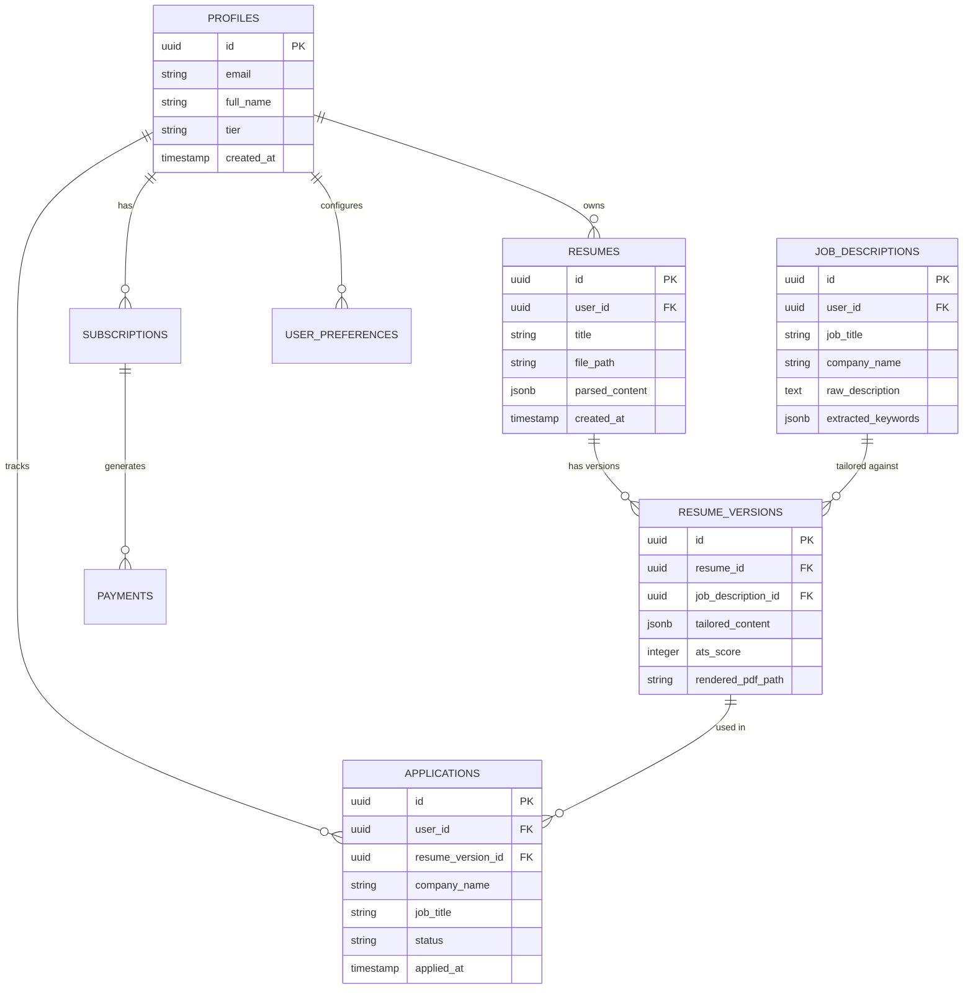

# Tailr4U - Database Schema & Blob Storage Specification

This document provides the full database schema, relational constraints, performance indexes, Row-Level Security (RLS) policies, and Blob Storage link references for **Tailr4U**.

> **Scope note**: The schema below is a simplified, representative core (5 tables) illustrating the account/resume/tailoring flow. The actual `supabase/migrations/` DDL defines **31+ tables** (`ai_generations`, `ats_analyses`, `cover_letter_sessions`, `credits`, `device_registrations`, `notifications`, `subscriptions`, `templates`, `workflow_runs`, `workflow_checkpoints`, etc.) — see [DATABASE_DDL_MIGRATIONS.md](file:///e:/PICTURES/OneDrive/Desktop/chrome-extension/docs/DATABASE_DDL_MIGRATIONS.md) for the authoritative, migration-sourced list. Column names below have also been corrected to match the actual `init_schema.sql` migration rather than an earlier draft schema.

---

## 1. Storage Buckets & Unstructured File Link Mapping

Unstructured binary files (candidate resume uploads, AI-generated tailored PDFs, template thumbnails, and profile avatars) are *designed* to be stored in **Supabase Storage** (or S3-compatible Blob Storage), and the bucket architecture and RLS policies below are real (defined in `supabase/migrations/20260713000002_rls_storage_policies.sql`). Database tables maintain deterministic URI object paths referencing these assets.

> ⚠️ **Current implementation gap**: `backend/api/dependencies.py::get_storage_service()` unconditionally returns `LocalStorageService` (local filesystem, `backend/local_uploads/`) — `SupabaseStorageService` (`backend/services/storage/supabase_storage.py`) is fully implemented but never instantiated anywhere in the app. On an ephemeral host (e.g. Render), uploaded resumes and generated PDFs do **not** survive a restart or redeploy. This needs to be wired up (construct a `supabase.Client` from `SUPABASE_URL`/`SUPABASE_SERVICE_ROLE_KEY` and swap the dependency) before the bucket architecture below is actually in effect in production.

### 1.1 Storage Buckets Architecture

| Bucket Name | Access Level | Stored Artifacts | Object Link Path Pattern |
| :--- | :--- | :--- | :--- |
| `original-resumes` | **Private (Auth Only)** | Candidate upload files (`PDF`, `DOCX`) | `original-resumes/{user_id}/{filename}` |
| `generated-resumes` | **Private (Auth Only)** | Rendered tailored PDFs (`PDF`) | `generated-resumes/{user_id}/{version_id}.pdf` |
| `template-previews` | **Public** | Template thumbnail images (`PNG`, `SVG`) | `template-previews/{template_name}.png` |
| `avatars` | **Public** | Candidate profile avatar images (`JPG`, `PNG`) | `avatars/{user_id}/avatar.{ext}` |

### 1.2 Object Link Reference Columns

- `resumes.file_path` → Link to original upload in `original-resumes`
- `resume_versions.rendered_pdf_path` → Link to compiled vector PDF in `generated-resumes`
- `resume_composition_plans.generated_pdf_storage_path` → Link to Playwright PDF output
- `profiles.avatar_url` → Link to user avatar in `avatars`

---

## 2. Core Entity Relationship Diagram (ERD)



---

## 3. Comprehensive Database Table Specifications

### 3.1 `public.profiles`
Stores core candidate account information, authentication links, and subscription tiers.

```sql
-- Source: supabase/migrations/20260713000000_init_schema.sql
CREATE TABLE IF NOT EXISTS public.profiles (
    id UUID PRIMARY KEY REFERENCES auth.users(id) ON DELETE CASCADE,
    email TEXT UNIQUE NOT NULL,
    full_name TEXT,
    avatar_url TEXT,
    subscription_plan TEXT NOT NULL DEFAULT 'free',
    credits_remaining INTEGER NOT NULL DEFAULT 5,
    resume_count INTEGER NOT NULL DEFAULT 0,
    created_at TIMESTAMP WITH TIME ZONE DEFAULT timezone('utc'::text, now()) NOT NULL,
    updated_at TIMESTAMP WITH TIME ZONE DEFAULT timezone('utc'::text, now()) NOT NULL,
    last_login TIMESTAMP WITH TIME ZONE,
    deleted_at TIMESTAMP WITH TIME ZONE
);

CREATE INDEX IF NOT EXISTS idx_profiles_email ON public.profiles(email);
```

---

### 3.2 `public.resumes`
Stores candidate master resumes (both raw uploaded file paths and parsed structured JSON representations).

```sql
-- Source: supabase/migrations/20260713000000_init_schema.sql
CREATE TABLE IF NOT EXISTS public.resumes (
    id UUID PRIMARY KEY DEFAULT gen_random_uuid(),
    user_id UUID NOT NULL REFERENCES public.profiles(id) ON DELETE CASCADE,
    file_path TEXT NOT NULL,
    file_name TEXT NOT NULL,
    file_size INTEGER NOT NULL,
    file_type TEXT NOT NULL CHECK (file_type IN ('PDF', 'DOCX')),
    parsed_content JSONB,
    embeddings TEXT,
    created_at TIMESTAMP WITH TIME ZONE DEFAULT timezone('utc'::text, now()) NOT NULL,
    updated_at TIMESTAMP WITH TIME ZONE DEFAULT timezone('utc'::text, now()) NOT NULL,
    deleted_at TIMESTAMP WITH TIME ZONE
);

CREATE INDEX IF NOT EXISTS idx_resumes_user_id ON public.resumes(user_id);
```

---

### 3.3 `public.job_descriptions`
Stores extracted job descriptions captured via Chrome Extension or user input.

```sql
CREATE TABLE IF NOT EXISTS public.job_descriptions (
    id UUID PRIMARY KEY DEFAULT gen_random_uuid(),
    user_id UUID NOT NULL REFERENCES public.profiles(id) ON DELETE CASCADE,
    company_name TEXT NOT NULL,
    job_title TEXT NOT NULL,
    job_url TEXT,
    raw_description TEXT NOT NULL,
    extracted_keywords JSONB DEFAULT '[]'::jsonb,
    experience_level TEXT,
    created_at TIMESTAMP WITH TIME ZONE DEFAULT now()
);

CREATE INDEX IF NOT EXISTS idx_jobs_user_id ON public.job_descriptions(user_id);
CREATE INDEX IF NOT EXISTS idx_jobs_company_title ON public.job_descriptions(company_name, job_title);
```

---

### 3.4 `public.resume_versions` (Tailored Resumes)
Stores AI-tailored resume variations produced for specific job descriptions.

```sql
CREATE TABLE IF NOT EXISTS public.resume_versions (
    id UUID PRIMARY KEY DEFAULT gen_random_uuid(),
    resume_id UUID NOT NULL REFERENCES public.resumes(id) ON DELETE CASCADE,
    job_description_id UUID REFERENCES public.job_descriptions(id) ON DELETE SET NULL,
    version_name TEXT NOT NULL,
    tailored_content JSONB NOT NULL,
    ats_score INTEGER CHECK (ats_score BETWEEN 0 AND 100),
    tailoring_report JSONB DEFAULT '{}'::jsonb,
    rendered_pdf_path TEXT,
    created_at TIMESTAMP WITH TIME ZONE DEFAULT now()
);

CREATE INDEX IF NOT EXISTS idx_versions_resume_id ON public.resume_versions(resume_id);
CREATE INDEX IF NOT EXISTS idx_versions_job_id ON public.resume_versions(job_description_id);
```

---

### 3.5 `public.applications`
Tracks job applications across status stages (Saved, Applied, Interviewing, Offer, Rejected).

```sql
CREATE TABLE IF NOT EXISTS public.applications (
    id UUID PRIMARY KEY DEFAULT gen_random_uuid(),
    user_id UUID NOT NULL REFERENCES public.profiles(id) ON DELETE CASCADE,
    resume_version_id UUID REFERENCES public.resume_versions(id) ON DELETE SET NULL,
    company_name TEXT NOT NULL,
    job_title TEXT NOT NULL,
    job_url TEXT,
    location TEXT,
    salary_range TEXT,
    status TEXT NOT NULL DEFAULT 'SAVED' CHECK (status IN ('SAVED', 'APPLIED', 'INTERVIEWING', 'OFFER', 'REJECTED')),
    applied_at TIMESTAMP WITH TIME ZONE,
    notes TEXT,
    created_at TIMESTAMP WITH TIME ZONE DEFAULT now(),
    updated_at TIMESTAMP WITH TIME ZONE DEFAULT now()
);

CREATE INDEX IF NOT EXISTS idx_applications_user_status ON public.applications(user_id, status);
```

---

### 3.6 `public.device_registrations`
Anti-abuse and rate limiting tracking for free-tier endpoints (actual table name — not `device_abuse_tracking`). Defined in `backend/supabase/migrations/20260801030000_device_registrations.sql` and consumed by `backend/app/services/device_abuse_service.py` and `backend/api/v1/admin_abuse.py`. See that migration file directly for the exact column list; it is not reproduced here to avoid re-introducing drift.

---

## 4. Row-Level Security (RLS) Policies

Tailr4U enforces strict multi-tenant isolation via PostgreSQL Row-Level Security.

```sql
-- Enable RLS on all sensitive tables
ALTER TABLE public.profiles ENABLE ROW LEVEL SECURITY;
ALTER TABLE public.resumes ENABLE ROW LEVEL SECURITY;
ALTER TABLE public.job_descriptions ENABLE ROW LEVEL SECURITY;
ALTER TABLE public.resume_versions ENABLE ROW LEVEL SECURITY;
ALTER TABLE public.applications ENABLE ROW LEVEL SECURITY;

-- Standard User Isolation Policies
CREATE POLICY "Users can only view their own profile" 
ON public.profiles FOR SELECT USING (auth.uid() = id);

CREATE POLICY "Users can only access their own resumes" 
ON public.resumes FOR ALL USING (auth.uid() = user_id);

CREATE POLICY "Users can only access their own applications" 
ON public.applications FOR ALL USING (auth.uid() = user_id);
```
