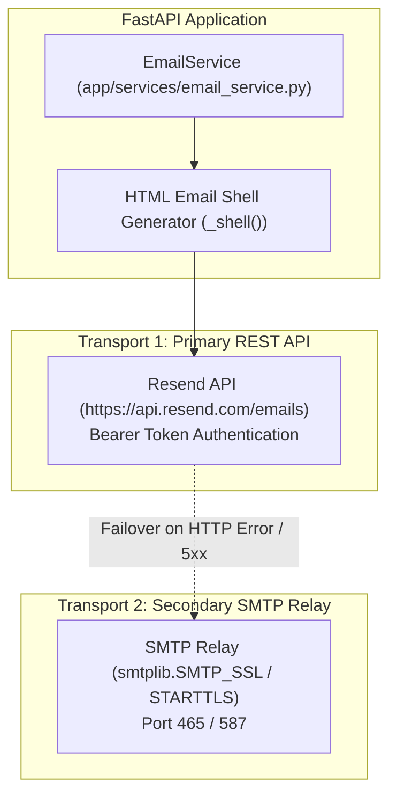

# Tailr4U - Transactional Email & Resend Integration Specification

This document details the transactional email delivery engine (`EmailService` in `app/services/email_service.py`), Resend REST API integration, SMTP fallback relay, and HTML email templates for **Tailr4U**.

---

## 1. Email Delivery Engine Architecture



---

## 2. Transports & Environment Configuration

### Primary Transport: Resend REST API
- **Endpoint**: `https://api.resend.com/emails`
- **Header**: `Authorization: Bearer RESEND_API_KEY`
- **Payload**:
  ```json
  {
    "from": "tailr4u <onboarding@resend.dev>",
    "to": ["candidate@example.com"],
    "subject": "Reset your tailr4u password",
    "html": "<html>...</html>",
    "text": "Plain text body..."
  }
  ```

### Secondary Transport: Standard SMTP Relay
Triggered automatically if `RESEND_API_KEY` is not provided or returns an API error:
- Uses Python `smtplib.SMTP_SSL` (Port 465) or `smtplib.SMTP` with `starttls()` (Port 587).
- Controlled via `SMTP_HOST`, `SMTP_PORT`, `SMTP_USERNAME`, `SMTP_PASSWORD`, `SMTP_FROM_EMAIL`.

---

## 3. Active Transactional Email Workflows

1. **Password Reset (`send_password_reset`)**:
   - Generates password reset link (`/#/reset-password?token=...`).
   - Expiration: `PASSWORD_RESET_MINUTES` (Default: 45 mins, `backend/core/config.py:42`).
2. **Email Verification (`send_verification`)**:
   - Verification link (`/#/verify-email?token=...`).
   - Expiration: `EMAIL_VERIFICATION_HOURS` (Default: 24 hrs).
3. **Password Change Notification (`send_password_changed`)**:
   - Instant security notification when account credentials change.
4. **Account Deletion OTP (`send_account_deletion_otp`)**:
   - Delivers 6-digit numeric OTP code for permanent account deletion requests (Expires in 10 mins).
5. **System & Reminder Notifications (`send_notification`)**:
   - Delivers interview follow-up reminders and application status updates.
