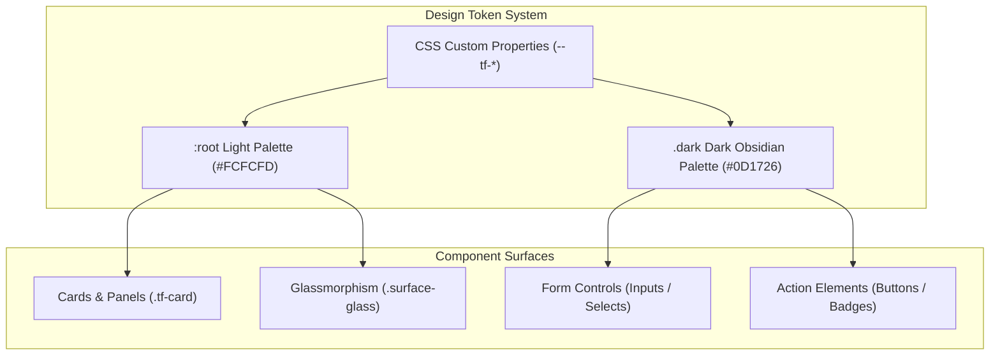

# Tailr4U - Frontend & Design System Specification

This document provides a comprehensive technical breakdown of the **Tailr4U Frontend Architecture**, Design Token System, Color Palettes, Glassmorphism Engine, Typography, Micro-Animations, and Component Design Standards.

---

## 1. Frontend Architecture Overview

The Tailr4U frontend is a high-performance Single Page Application (SPA) built with **React 18** and **Vite 5**, styled with **TailwindCSS** and custom design token CSS variables, and animated via **Framer Motion**.

### 1.1 Technology Stack Matrix

| Area | Framework / Library | Role & Purpose |
| :--- | :--- | :--- |
| **Core Framework** | React 18 (`react`, `react-dom`) | Component architecture, state management & hooks |
| **Build Tooling** | Vite 5 (`vite`) | Hot Module Replacement (HMR) & production bundle optimization |
| **Styling Engine** | TailwindCSS v3 + CSS Variables | Utility-first layout & custom design tokens |
| **Iconography** | Lucide React (`lucide-react`) | Crisp vector iconography set |
| **Animations** | Framer Motion (`framer-motion`) | Glassmorphism transitions, spring dynamics & page routes |
| **HTTP Client** | Axios (`axios`) | REST API client with Bearer JWT interceptors |
| **Extension UI** | Shadow DOM Container | Isolated Chrome Extension overlay injected into job portals |

---

## 2. Comprehensive Color Token System & Palettes

Tailr4U utilizes an adaptive design token architecture with explicit Light Mode (`:root`) and Dark Mode (`.dark`) material layers. All color primitives rely on CSS custom properties (`--tf-*`).



---

### 2.1 Color Palette Reference

#### Primary Surface & Background Tokens

| Token Name | Light Mode (Default) | Dark Mode (`.dark`) | Application / Purpose |
| :--- | :--- | :--- | :--- |
| `--tf-bg` | `#FCFCFD` | `#0D1726` | Main viewport canvas background |
| `--tf-surface` | `#FFFFFF` | `#142238` | Primary card container background |
| `--tf-surface-2` | `#F7F8FA` | `#192a42` | Secondary inset container background |
| `--tf-surface-3` | `#EAECEF` | `#213550` | Elevated dropdown / menu container |
| `--tf-surface-floating` | `rgba(255,255,255,0.85)` | `rgba(20,34,56,0.82)` | Floating modals & context overlays |

#### Border & Divider Tokens

| Token Name | Light Mode | Dark Mode | Application |
| :--- | :--- | :--- | :--- |
| `--tf-border` | `#EAECEF` | `rgba(166,201,242,0.09)` | Standard card & component dividers |
| `--tf-border-strong` | `#D8DBE0` | `rgba(166,201,242,0.17)` | Active focus borders & modal edges |

#### Typography & Content Tokens

| Token Name | Light Mode | Dark Mode | Usage |
| :--- | :--- | :--- | :--- |
| `--tf-text` | `#0B0D12` | `#F4F8FF` | Primary headings & body text |
| `--tf-text-secondary` | `#5A6472` | `#ABBAD0` | Subtitles, labels & secondary text |
| `--tf-text-tertiary` | `#8B93A1` | `#75869E` | Disabled text, captions & timestamps |

#### Brand Accent & Status Tokens

| Brand Token | Light Mode Hex | Dark Mode Hex | Usage & Meaning |
| :--- | :--- | :--- | :--- |
| `--tf-accent` | `#2E5BFF` | `#5B96F7` | Primary brand action color (Buttons, Active Tabs) |
| `--tf-accent-hover` | `#1E48E0` | `#79AAF9` | Hover state for primary interactive elements |
| `--tf-accent-secondary` | `#00BDA5` | `#FB923C` | Secondary accent highlights & badges |
| `--tf-success` | `#12A150` | `#55AD7B` | High ATS scores (80%+), positive alerts |
| `--tf-warning` | `#B7791F` | `#FB923C` | Medium ATS scores (50-79%), pending actions |
| `--tf-danger` | `#D0342C` | `#C86F72` | Critical gap alerts, deletion prompts |

---

### 2.2 Glassmorphism & Ambient Material Layers

Tailr4U implements multi-layered depth using hardware-accelerated CSS `backdrop-filter` and dynamic cursor radial lighting effects.

#### Glassmorphism Class (`.surface-glass`)
```css
.dark #root .surface-glass {
  position: relative;
  isolation: isolate;
  background-color: rgba(25: 29: 35, 0.66);
  background-image:
    linear-gradient(180deg, rgba(255, 255, 255, 0.085), rgba(255, 255, 255, 0.018) 42%, rgba(0, 0, 0, 0.035)),
    radial-gradient(900px circle at 16% -20%, rgba(255, 255, 255, 0.075), transparent 42%);
  border-color: rgba(255, 255, 255, 0.105);
  box-shadow:
    inset 0 1px 0 rgba(255, 255, 255, 0.09),
    inset 0 -1px 0 rgba(255, 255, 255, 0.025),
    var(--tf-shadow-floating);
  backdrop-filter: blur(24px) saturate(125%);
}
```

#### Ambient Spotlight (`.adaptive-ambient`)
The body background incorporates three distinct radial ambient gradients that subtlely glow and animate:
```css
.dark .adaptive-ambient {
  background:
    radial-gradient(circle at 18% -8%, rgba(90, 121, 180, 0.14), transparent 34rem),
    radial-gradient(circle at 92% 22%, rgba(71, 125, 119, 0.08), transparent 32rem),
    radial-gradient(circle at 50% 112%, rgba(96, 80, 132, 0.065), transparent 38rem),
    linear-gradient(145deg, #12151a 0%, #101216 52%, #0d0f13 100%);
}
```

---

## 3. Typography & Responsive Layout Grid

### 3.1 Font Family Hierarchy
1. **Primary Font**: `Plus Jakarta Sans` (Google Fonts) – Modern, clean geometric sans-serif for dashboard headings and numbers.
2. **Secondary Font**: `Inter` / `Geist` – Crisp legibility for dense technical text, JSON editors, and body copy.
3. **Monospace Font**: `JetBrains Mono` / `Fira Code` – For ATS score JSON diff comparisons.

### 3.2 Modular Typography Scale

| Style Level | Font Size | Line Height | Weight | Letter Spacing |
| :--- | :--- | :--- | :--- | :--- |
| **Display 1** | `36px` (`2.25rem`) | `44px` | `800` (Bold) | `-0.025em` |
| **Heading 1** | `28px` (`1.75rem`) | `36px` | `700` (Bold) | `-0.02em` |
| **Heading 2** | `22px` (`1.375rem`)| `30px` | `600` (SemiBold) | `-0.015em` |
| **Heading 3** | `18px` (`1.125rem`)| `26px` | `600` (SemiBold) | `-0.01em` |
| **Body Large**| `16px` (`1.0rem`)  | `24px` | `400` / `500` | `0em` |
| **Body Regular**| `14px` (`0.875rem`)| `22px` | `400` (Regular) | `0em` |
| **Caption**   | `12px` (`0.75rem`) | `18px` | `500` (Medium) | `0.01em` |

---

### 3.3 Grid & Elevation Tokens

- **Max Content Width**: `1760px` (`--content-wide-max`)
- **Reading Content Width**: `920px` (`--content-reading-max`)
- **Header Height**: `64px` (`--app-header-height`)
- **Card Border Radius**: `16px` (`--tf-radius-card`)
- **Control Border Radius**: `10px` (`--tf-radius-control`)
- **Pill Radius**: `999px` (`--tf-radius-pill`)

---

## 4. Micro-Animations & Interaction Tokens

Tailr4U provides smooth responsive motion using CSS variables and Framer Motion spring physics.

### 4.1 Motion Duration & Easing Tokens

```css
:root {
  --motion-instant: 80ms;
  --motion-fast: 140ms;
  --motion-base: 200ms;
  --motion-slow: 280ms;
  --motion-emphasis: 420ms;

  --ease-standard: cubic-bezier(0.2, 0, 0, 1);
  --ease-enter: cubic-bezier(0.16, 1, 0.3, 1);
  --ease-exit: cubic-bezier(0.4, 0, 1, 1);
  --ease-spring-soft: cubic-bezier(0.22, 1, 0.36, 1);
  --ease-spring-snappy: cubic-bezier(0.34, 1.4, 0.64, 1);
}
```

### 4.2 Micro-Interactions

- **Button Hover Elevation**:
  ```css
  button:not(:disabled):hover {
    transform: translateY(-1px);
    transition: transform 140ms var(--ease-spring-soft);
  }
  button:not(:disabled):active {
    transform: scale(0.98);
  }
  ```
- **Custom Precision Cursor (`[data-cursor]`)**: On desktop pointer devices (`pointer: fine`), native cursors are hidden (`cursor: none !important`) and replaced by a smooth hardware-accelerated glowing cursor dot that scales up when hovering interactive buttons or links.

---

## 5. Key Component Design Standards

### 5.1 ATS Match Score Radial Badge
- **80% - 100% Score**: Emerald Glow (`#55AD7B`), text `#55AD7B`, background `rgba(85, 173, 123, 0.12)`.
- **50% - 79% Score**: Amber Glow (`#FB923C`), text `#FB923C`, background `rgba(251, 146, 60, 0.12)`.
- **0% - 49% Score**: Crimson Red (`#C86F72`), text `#C86F72`, background `rgba(200, 111, 114, 0.12)`.

### 5.2 Side-by-Side Tailoring Diff Editor
- Displays original master resume bullet points on the left pane and proposed AI-tailored bullet points on the right.
- Highlighting:
  - **Inserted Keywords**: Green pill tag (`bg-emerald-500/10 text-emerald-400 border border-emerald-500/20`).
  - **Removed Phrases**: Strikethrough text with red tone (`line-through text-red-400/70`).
- Individual Bullet Acceptance: Single-click checkmark / reject controls allowing granular editing before PDF compilation.

---

## 6. Chrome Extension Shadow DOM UI Isolation

To guarantee zero CSS contamination when injected into external job board pages (LinkedIn, Indeed, Lever, Greenhouse):
- The content script creates a closed Shadow Root container:
  ```javascript
  const host = document.createElement('div');
  host.id = 'tailr4u-extension-root';
  const shadow = host.attachShadow({ mode: 'open' });
  ```
- Tailr4U design token styles (`styles.css` compiled bundle) are injected directly inside the Shadow Root.
- Host page styles (`bootstrap`, `tailwind`, or custom company styles) are completely isolated and unable to affect the floating extension widget.

---

## 7. Print & Playwright PDF Styles

For vector PDF compilation, the frontend includes a dedicated print media engine (`@media print` in `index.css`):

```css
@media print {
  @page {
    margin: 0;
    size: letter portrait;
  }
  body {
    margin: 0;
    -webkit-print-color-adjust: exact !important;
    print-color-adjust: exact !important;
    background: white !important;
  }
  #resume-print-container {
    width: 210mm !important;
    height: 297mm !important;
    border: none !important;
    box-shadow: none !important;
  }
}
```

### Print Compression Engine Classes
Dynamically adjusts font sizes to prevent multi-page spillover on dense resumes:
- `.print-compression-level-0`: `16px` font size (Standard)
- `.print-compression-level-1`: `15px` font size
- `.print-compression-level-2`: `14px` font size
- `.print-compression-level-3`: `13.5px` font size (Tight fit)
