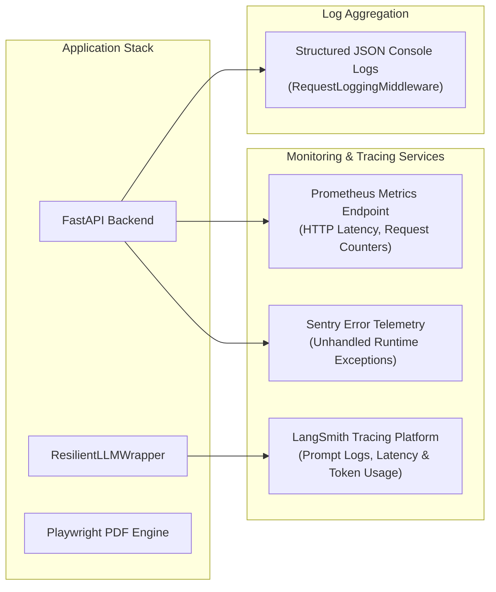

# Tailr4U - Observability, Metrics & Telemetry Specification

This document details the observability architecture, health probe endpoints, structured logging protocols, LLM prompt tracing with LangSmith, error telemetry with Sentry, and monitoring/alerting strategies for **Tailr4U**.

---

## 1. Observability Architecture Overview



---

## 2. Health & Readiness Probe Endpoints

Tailr4U exposes dedicated health verification endpoints used by container orchestrators (Kubernetes, Render, Docker Compose) to monitor application liveness and dependency readiness.

### 2.1 Endpoint Summary

| Route | HTTP Method | Auth | Purpose | Response Payload |
| :--- | :--- | :--- | :--- | :--- |
| `/live` | `GET` | Public | Liveness probe (verifies Uvicorn event loop) | `{"status": "alive"}` |
| `/ready` | `GET` | Public | Readiness probe (verifies DB connection pool) | `{"status": "ready", "database": "connected"}` |
| `/health` | `GET` | Public | Full system status & version audit | `{"status": "healthy", "version": "3.0.0"}` |
| `/api/observability/status` | `GET` | Public | LangSmith configuration health | `{"enabled": true, "project": "tailr4u-prod"}` |

---

## 3. Structured Request Logging Middleware

The backend uses `RequestLoggingMiddleware` (`core/middleware.py`) to intercept every incoming HTTP request and emit structured JSON log entries.

### Log Format Output
```json
{
  "timestamp": "2026-08-01T21:55:12.345Z",
  "level": "INFO",
  "method": "POST",
  "path": "/api/v1/tailor/resume",
  "status_code": 200,
  "duration_ms": 1420.85,
  "client_ip": "203.0.113.195",
  "user_id": "a1b2c3d4-e5f6-7890-abcd-1234567890ab"
}
```

---

## 4. LLM Prompt & Chain Tracing (LangSmith Integration)

All AI invocations routed through `gemini_service.py` (`ResilientLLMWrapper`) integrate natively with **LangSmith** via `core/observability.py`.

### 4.1 Environment Configuration
- `LANGSMITH_TRACING=true`
- `LANGSMITH_API_KEY=<secret_key>`
- `LANGSMITH_PROJECT=tailr4u-production`
- `LANGSMITH_ENDPOINT=https://api.smith.langchain.com`

### 4.2 Tracked Metrics in LangSmith
1. **Prompt Versioning**: Complete record of input prompt templates and output structured JSON payloads.
2. **Token Consumption**: Input/output token counts for Groq and Gemini invocations.
3. **Execution Latency**: Time spent during model invocation vs. post-processing schema parsing.
4. **Failover Audit**: Logs every failover event when the primary model (Groq) triggers the fallback (Gemini 2.0 Flash).

---

## 5. Error Telemetry (Sentry Integration)

- **SDK Configuration**: `sentry-sdk[fastapi]` initialized during startup in `main.py`.
- **Captured Events**:
  - `500 Internal Server Errors`
  - Unhandled database connection timeouts (`asyncpg.Exceptions`)
  - Playwright browser launch failures
  - Storage bucket upload failures
- **PII Scrubbing**: Authorization headers, passwords, and candidate resume raw texts are stripped prior to transmission to Sentry servers.

---

## 6. Prometheus & Grafana Monitoring Roadmap

- **Prometheus Scrape Endpoint**: `/metrics`
- **Key Metrics Tracked**:
  - `http_requests_total{method, endpoint, status}`
  - `http_request_duration_seconds_bucket`
  - `llm_token_usage_total{model, type}`
  - `pdf_generation_duration_seconds`
  - `db_pool_active_connections`
- **Alerting Thresholds**:
  - Alert if HTTP 5xx error rate exceeds `2%` over 5 minutes.
  - Alert if PDF compilation latency exceeds `8 seconds` (`P95`).
  - Alert if Redis connection drops or database pool is exhausted.
