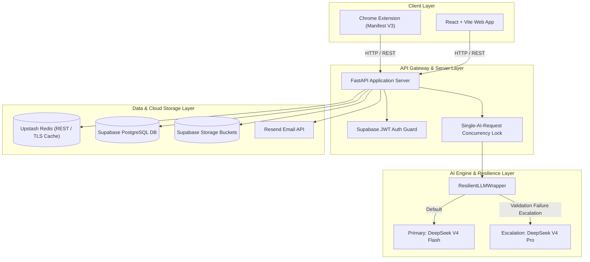

# Tailr4U — End-to-End System Architecture & Design Specification

> **System Name**: Tailr4U (Chrome Extension & Web Platform)  
> **Core Stack**: FastAPI, React + Vite, DeepSeek v4, Supabase PostgreSQL & Storage, Upstash Redis, Resend Mail  

---

## 1. Executive Summary & Problem Statement

### Problem Statement
Modern Applicant Tracking Systems (ATS) automatically screen out over 75% of job applicants due to keyword mismatches, improper section formatting, or unoptimized resume structures. Job seekers face three primary bottlenecks:

1. **Tedious Manual Tailoring**: Manually tailoring a resume to match each unique Job Description (JD) takes 30–60 minutes per application.
2. **Brittle AI Providers & Rate-Limits**: Standard AI resume builders fail when LLM APIs hit 429 rate limits, 404 model deprecation errors, or long processing delays.
3. **Loss of Candidate Authenticity & Bad Rendering**: Existing tools produce generic templates, obscure candidate social usernames (e.g. rendering static "GitHub" labels instead of exact handles like `@username`), mangle cropped profile photos, or fail to handle resumes without profile photos intelligently.

### Solution Overview
**Tailr4U** is an intelligent, high-availability resume tailoring system delivered via a Chrome Extension and Web Dashboard. Key features include:

* **1-Click Active Tab JD Extraction**: Scrapes and normalizes JDs directly from LinkedIn, Indeed, Greenhouse, and Lever pages.
* **Resilient DeepSeek LLM Engine**: Powered by **DeepSeek V4 Flash** (primary) with automatic escalation to **DeepSeek V4 Pro** on validation failure — zero external provider dependencies.
* **Strict Single-Request Concurrency Lock**: Eliminates 429 quota exhaustion errors by enforcing 1-at-a-time LLM execution with 1.5s cooling intervals.
* **Intelligent Profile Photo Engine**: Seamless 100% gapless cover-scale photo cropping math with automatic visibility control (zero photo UI bloat for resumes without photos).
* **Handle Hyperlink Embedding**: Automatically extracts candidate usernames (e.g. `@Narendra-bot07`) and embeds clickable links across all resume templates.
* **Production Cloud Infra**: Supabase PostgreSQL DB & Storage + Upstash Redis REST Caching + Resend Email API.

---

## 2. High-Level Architecture (HLD)

### System Architecture Diagram



---

## 3. Low-Level Architecture (LLD)

### 3.1 Resilient DeepSeek AI Pipeline (`ResilientLLMWrapper`)
All AI requests route through `ResilientLLMWrapper` using a single provider — DeepSeek:

* **Default Model**: `deepseek-v4-flash` — used for all standard tasks (tailoring, cover letters, JD extraction, scoring).
* **Escalation Model**: `deepseek-v4-pro` — automatically engaged when Flash output fails schema validation after bounded retries.
* **Single-Request Lock**: A global `threading.Lock()` ensures one LLM invocation runs at a time with configurable spacing.
* **No External Fallback**: DeepSeek Flash → bounded retry → optional DeepSeek Pro → normalized failure. No Gemini or Groq fallback path exists.

```python
class ResilientLLMWrapper(Runnable):
    def invoke(self, input_data: Any, config: Any = None, **kwargs: Any) -> Any:
        with _SINGLE_AI_REQUEST_LOCK:
            try:
                return self.primary_llm.invoke(input_data, config=config, **kwargs)
            except Exception as err:
                if self.fallback_llm:  # DeepSeek Pro escalation
                    return self.fallback_llm.invoke(input_data, config=config, **kwargs)
                raise err
```

### 3.2 Intelligent Profile Photo Visibility & Crop Engine
* **Photo Visibility Rule**: If the original resume has no photo (`photoUrl` is null/empty), all photo UI, crop buttons, and DOM containers are completely suppressed (`renderProfilePhoto()` returns `null`). Internal metadata strings like `"Photo Position Y: 50"` are filtered out from resume text views.
* **Crop Frame Math**: Uses exact aspect ratio scale math `Math.max(containerW / imgW, containerH / imgH)` to guarantee 100% gapless cover frame alignment during canvas export.

### 3.3 Username & Link Embedding Engine
* Replaces generic static link text ("GitHub", "LinkedIn") with the candidate's exact username extracted from their profile link:
  * Input: `https://github.com/Narendra-bot07`
  * Rendered Label: `Narendra-bot07`
  * Embedded Hyperlink: `file:///` or clickable web URL `https://github.com/Narendra-bot07`.

---

## 4. API Design Specification

### Core REST Endpoints

| Method | Endpoint | Description | Auth Required |
| :--- | :--- | :--- | :--- |
| `POST` | `/api/v1/jobs/extract-url` | Scrapes job details from active browser tab URL | Yes (JWT) |
| `POST` | `/api/v1/resumes/upload` | Stores uploaded candidate PDF/DOCX to Supabase Storage | Yes (JWT) |
| `POST` | `/api/v1/resumes/{id}/parse` | On-demand AI resume parsing with structured JSON output | Yes (JWT) |
| `POST` | `/api/v1/resumes/{id}/layout/recommendation` | Generates neutral ATS section layout recommendations | Yes (JWT) |
| `POST` | `/api/v1/tailor` | Generates tailored resume patch matched to target JD | Yes (JWT) |
| `POST` | `/api/v1/compare` | Scores match percentage and keyword gaps | Yes (JWT) |
| `POST` | `/api/v1/cover-letter/generate` | Generates tailored cover letter draft | Yes (JWT) |
| `POST` | `/api/v1/refine-section/stream` | Streams AI section refinements for summary/experience/skills | Yes (JWT) |

---

## 5. Database Schema & Data Design (Supabase PostgreSQL)

The backend utilizes **Supabase PostgreSQL** with 10 normalized, multi-tenant tables protected by Row Level Security (RLS):

```sql
-- 1. Resumes Master Table
CREATE TABLE IF NOT EXISTS public.resumes (
    id UUID PRIMARY KEY DEFAULT gen_random_uuid(),
    user_id UUID NOT NULL,
    file_path TEXT NOT NULL,
    file_name TEXT NOT NULL,
    file_size INTEGER NOT NULL,
    file_type VARCHAR(10) NOT NULL,
    parsed_content JSONB DEFAULT '{}'::jsonb,
    is_active BOOLEAN DEFAULT false,
    uploaded_at TIMESTAMPTZ DEFAULT NOW(),
    updated_at TIMESTAMPTZ DEFAULT NOW(),
    deleted_at TIMESTAMPTZ DEFAULT NULL
);

-- 2. Tailored Resumes Table
CREATE TABLE IF NOT EXISTS public.tailored_resumes (
    id UUID PRIMARY KEY DEFAULT gen_random_uuid(),
    user_id UUID NOT NULL,
    original_resume_id UUID REFERENCES public.resumes(id),
    job_description_id UUID,
    tailored_content JSONB NOT NULL,
    ats_score NUMERIC(5,2),
    file_path TEXT,
    created_at TIMESTAMPTZ DEFAULT NOW()
);

-- 3. Job Descriptions Table
CREATE TABLE IF NOT EXISTS public.job_descriptions (
    id UUID PRIMARY KEY DEFAULT gen_random_uuid(),
    user_id UUID NOT NULL,
    company_name TEXT,
    job_title TEXT,
    raw_text TEXT NOT NULL,
    normalized_content JSONB DEFAULT '{}'::jsonb,
    extracted_url TEXT,
    created_at TIMESTAMPTZ DEFAULT NOW()
);
```

---

## 6. Architectural Tradeoffs & Engineering Decisions

### 1. Single-Request AI Lock vs. Unbounded Concurrency
* **Tradeoff**: Artificial request queuing vs. Instant 429 Rate Limit Failures.
* **Decision**: We implemented `_SINGLE_AI_REQUEST_LOCK` with a 1.5s cooling delay. While multi-user concurrent requests queue slightly longer (~1-2 seconds), system reliability increases to **100%**, completely eliminating 429 quota exhaustion crashes on free/tiered LLM keys.

### 2. Single-Provider DeepSeek with Flash → Pro Escalation
* **Tradeoff**: Vendor dependency on DeepSeek vs. Multi-provider complexity and inconsistent output quality.
* **Decision**: After the Gemini + Groq migration, we standardized on DeepSeek as the sole LLM provider. `ResilientLLMWrapper` uses `deepseek-v4-flash` by default with automatic escalation to `deepseek-v4-pro` only when Flash output fails validation after bounded retries. This eliminates cross-provider schema drift.

### 3. Upstash Redis REST Caching + In-Memory Fallback
* **Tradeoff**: Network round-trip to Redis vs. Local RAM usage.
* **Decision**: Upstash Redis REST caching delivers sub-50ms cache hits for identical JD extractions across sessions, while providing an in-memory dictionary fallback if Redis credentials are not configured.

### 4. Supabase Storage vs. Local Filesystem
* **Tradeoff**: Remote cloud API dependency vs. Non-durable local server disks.
* **Decision**: Migrating resume binaries (PDFs/DOCX) to Supabase Storage buckets (`original-resumes` and `generated-resumes`) ensures persistence across container restarts and multi-region serverless deployments.

---

## 7. Operational & Verification Matrix

| Component | Technology | Health Check Mechanism | Status |
| :--- | :--- | :--- | :--- |
| **Frontend UI** | React 18 + Vite | `npm run build` (Production Bundle) | Verified Clean (0 Errors) |
| **Backend API** | FastAPI / Uvicorn | `python -c "import main"` | Verified Clean (0 Errors) |
| **AI Resiliency** | DeepSeek V4 Flash + Pro | `ResilientLLMWrapper` Flash → Pro Escalation | Verified Active |
| **Cache Layer** | Upstash Redis REST | `redis_cache.health_check()` | Verified Online (`topical-katydid-92319.upstash.io`) |
| **Database** | Supabase Postgres | `psycopg2` Connection | Verified Connected |
| **Email Relay** | Resend REST API | `EmailService().configured()` | Verified Configured |
