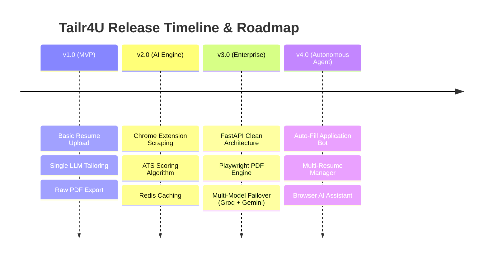

# Tailr4U - Product & Technical Roadmap

This document details the feature roadmap, release milestones, active engineering tasks, and long-term vision for **Tailr4U**.

---

## 1. Version Release Milestones Overview

---

## 2. Milestone Release Roadmap Details

### 2.1 Completed Milestones (`v1.0` - `v3.0`)

- [x] **v1.0 Core MVP Release**:
  - Initial FastAPI REST backend with basic resume upload and PDF parsing.
  - Integration with LLM for resume summary and bullet point rewriting.

- [x] **v2.0 AI Engine & Extension Release**:
  - Chrome Extension Manifest V3 for instant job description DOM scraping.
  - ATS Match Score calculator and skill gap analysis engine.
  - Redis caching for LLM responses to reduce API latency.
  - Basic application status tracker.

- [x] **v3.0 Enterprise Clean Architecture (Current Release)**:
  - Complete 4-layer Clean Architecture refactoring of FastAPI backend (`api/v1/`).
  - Headless Chromium Playwright PDF compilation pipeline for vector-crisp PDFs.
  - `ResilientLLMWrapper` introducing multi-model failover (Groq Llama-3.3-70b → Gemini 2.0 Flash → Gemini 1.5 Flash).
  - Row-Level Security (RLS) policies on Supabase PostgreSQL tables and storage buckets.
  - LangSmith tracing integration and health probe endpoints (`/live`, `/ready`, `/health`).

---

### 2.2 In Progress (`v3.5` Enhancement Stage)

- [ ] **Multi-Template Customizer**:
  - Adding 5 additional ATS-optimized LaTeX and modern HTML/CSS templates.
  - Live typography, margin, and color accent controls in React dashboard.

- [ ] **Advanced Cover Letter Customizer**:
  - Custom tone controls (Executive, Tech Professional, Startup Enthusiast).
  - PDF export for generated cover letters matching the candidate's selected resume template.

- [ ] **Enhanced Analytics Dashboard**:
  - Visual charts tracking application success rate, response rates, and ATS score improvements over time.

---

### 2.3 Next Release (`v4.0` Autonomous Application Agent)

- [ ] **Chrome Extension Auto-Fill Application Assistant**:
  - AI-assisted auto-filling of common job application form fields (Lever, Greenhouse, Workday).
  - Single-click insertion of tailored answers for custom employer questions.

- [ ] **Batch Resume Tailoring & Matching**:
  - Capability to select multiple saved job descriptions and tailor resumes for all in parallel.

- [ ] **Automated Interview Prep & Question Generator**:
  - Generates behavioral and technical interview questions based on the candidate's tailored resume and JD gap analysis.

---

### 2.4 Future Backlog

- [ ] **Email & Calendar Reminders Integration**:
  - Automated interview follow-up reminders via Google Calendar and email notifications.
- [ ] **Team & Enterprise Organization Tiers**:
  - Collaborative candidate review features for career coaches and recruiting agencies.
