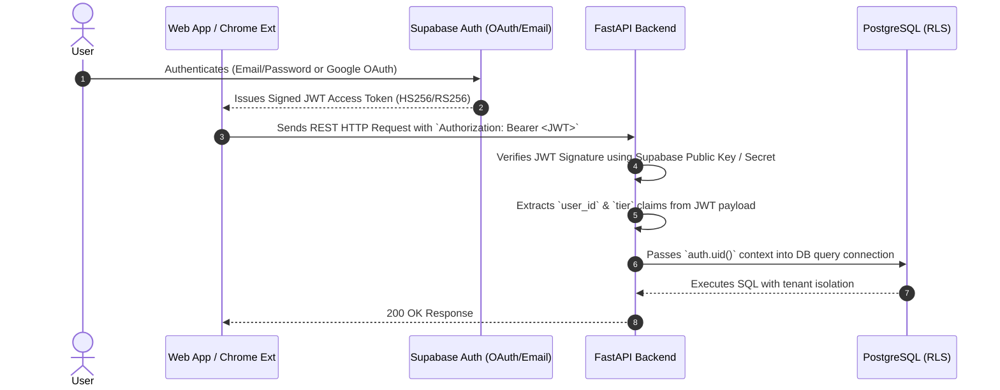

# Tailr4U - Security, Authentication & Threat Model Specification

This document details the security posture, authentication architecture, rate-limiting safeguards, data encryption standards, and threat model for **Tailr4U**.

---

## 1. Authentication & Session Architecture

Tailr4U delegates identity management and authentication credentials to **Supabase Auth** backed by OAuth 2.0 and JWT (JSON Web Tokens).

### 1.1 JWT Validation Protocol
- FastAPI dependency (`api/dependencies.py`) intercepts every non-public route.
- Verifies `Authorization: Bearer <token>` header.
- Decodes header using standard asymmetric RSA or shared JWT secret.
- Enforces token expiration (`exp`), issuer (`iss`), and audience (`aud`).

---

## 2. Authorization & Multi-Tenant Isolation

### 2.1 Database Row-Level Security (RLS)
- All PostgreSQL tenant data tables (`profiles`, `resumes`, `job_descriptions`, `resume_versions`, `applications`) have RLS policies enabled.
- Queries are strictly scoped via `auth.uid() = user_id`.
- Even if a client bypasses backend API routing, direct database calls cannot view or mutate another tenant's records.

### 2.2 Storage Bucket Access Control
- Storage object names enforce a deterministic prefix hierarchy:
  `original-resumes/{user_id}/{filename}`
- Supabase Storage RLS policies verify that `(storage.foldername(name))[1] == auth.uid()::text`.
- Private buckets (`original-resumes`, `generated-resumes`) reject any unauthorized direct HTTP GET access.

---

## 3. Anti-Abuse, Rate Limiting & Threat Controls

### 3.1 Rate Limiting Architecture
To prevent API key depletion and DDOS attacks on LLM pipelines:
1. **IP & Device Fingerprinting**: `device_abuse_tracking` table records client IP addresses and Chrome extension device signatures.
2. **Tiered Endpoint Throttling**:
   - Free Tier Users: Maximum 10 tailoring requests per month, throttled to 1 request every 60 seconds.
   - Pro Tier Users: Higher tier quota with minimal throttling.
3. **Resilient AI Spacing**: `_SINGLE_AI_REQUEST_LOCK` enforces a strict minimum spacing (`1.5` seconds) between LLM invocations to prevent `429 Quota Exceeded` errors on upstream providers.

### 3.2 CORS & HTTP Security Headers
FastAPI configures `CORSMiddleware` with explicit origin whitelisting:
- Allowed Origins: `https://app.tailr4u.com`, `http://localhost:5173`
- Allowed Origin Regex: `^chrome-extension://.+$` (Permits Manifest V3 extension communications)
- Credentials Allowed: `true`
- Security Headers Enforced:
  - `X-Content-Type-Options: nosniff`
  - `X-Frame-Options: DENY`
  - `Content-Security-Policy: default-src 'self'`

---

## 4. Input Validation & File Upload Safeguards

- **Strict Schema Enforcement**: All incoming HTTP payloads are validated against `Pydantic` v2 models. Unrecognized fields are rejected.
- **File Upload Validation**:
  - Allowed File Extensions: `.pdf`, `.docx`, `.txt`
  - Maximum File Size: `10 MB`
  - MIME Type Inspection: Verifies header magic bytes (`%PDF-`, `PK\x03\x04`) rather than trusting file extensions alone.
  - Sanitization: Replaces special characters in filenames to prevent path traversal (`../`).

---

## 5. Threat Model Analysis

| Threat Vectors | Risk Level | Mitigation Standard |
| :--- | :--- | :--- |
| **Unauthorized Data Access** | High | PostgreSQL Row-Level Security (RLS) & JWT verification on every router |
| **API Key Depletion (LLM Rate Limit)**| High | Redis prompt caching, single-request lock, bounded retry with optional DeepSeek Pro escalation |
| **Extension DOM Injection Attacks** | Medium | Isolated Shadow DOM for injected overlay; strict innerText sanitization |
| **Malicious PDF Upload Exploits** | Medium | Content-type magic byte check, sandbox parsing, size limit enforcement |
| **Cross-Origin Request Forgery (CSRF)**| Low | Stateless JWT authentication in Authorization header; no ambient cookies |

---

## 6. Security Checklist

- [x] All database tables enforce Row-Level Security (RLS).
- [x] Storage buckets isolate files under `{user_id}` directories.
- [x] Environment secrets (`DEEPSEEK_API_KEY`, `SUPABASE_JWT_SECRET`) stored in `.env` and excluded from git version control.
- [x] CORS origin regex strictly restricted to production web domains and Chrome Extension schemes.
- [x] RequestLoggingMiddleware strips authorization headers from output logs.
- [x] Headless Chromium Playwright sandbox runs under non-root unprivileged container users.
