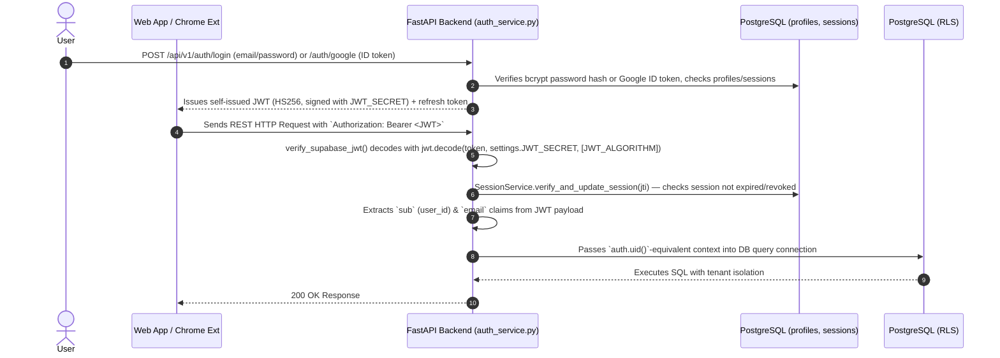

# Tailr4U - Security, Authentication & Threat Model Specification

This document details the security posture, authentication architecture, rate-limiting safeguards, data encryption standards, and threat model for **Tailr4U**.

---

## 1. Authentication & Session Architecture

> **Correction**: Tailr4U does **not** use Supabase Auth for identity. Authentication is fully custom: passwords are hashed with `bcrypt` (`core/security.py::hash_password`, 12 rounds) and stored in `public.profiles`, and sessions are self-issued HS256 JWTs signed with the app's own `JWT_SECRET` — verified by `core/security.py::verify_supabase_jwt()` (a misleading legacy name; it performs no call to Supabase at all). Supabase is used only as the Postgres host (and, per `SUPABASE_URL`/`SUPABASE_SERVICE_ROLE_KEY`, for storage — see [DATABASE.md](file:///e:/PICTURES/OneDrive/Desktop/chrome-extension/docs/DATABASE.md) for the storage-wiring gap). Google Sign-In goes through `google-auth` token verification (`POST /auth/google`, `api/v1/auth.py:335`), then issues the same self-issued session JWT — it is not routed through Supabase Auth either.

### 1.1 JWT Validation Protocol
- FastAPI dependency `verify_supabase_jwt` (`core/security.py:8`) intercepts every non-public route via `Depends()`.
- Verifies `Authorization: Bearer <token>` header.
- Decodes using `jwt.decode(token, settings.JWT_SECRET, algorithms=[settings.JWT_ALGORITHM])` — a single shared HS256 secret, not asymmetric RSA, and no Supabase public key is involved.
- Enforces token expiration (`exp`, via `pyjwt`'s built-in check) and additionally checks the `jti` claim against `SessionService` so a session can be revoked server-side even before the JWT expires (logout, password reset, account deletion).
- A `local-dev-token` bypass exists for local development seeding (`core/security.py:25-30`) — returns a fixed local-developer identity without touching the DB. Confirm this path is unreachable in production (e.g. via the seeded UUID never matching a real `profiles` row, since RLS/foreign-key constraints would reject writes under that id in a real deployment).

---

## 2. Authorization & Multi-Tenant Isolation

### 2.1 Database Row-Level Security (RLS)
- All PostgreSQL tenant data tables (`profiles`, `resumes`, `job_descriptions`, `resume_versions`, `applications`) have RLS policies enabled.
- Queries are strictly scoped via `auth.uid() = user_id`.
- Even if a client bypasses backend API routing, direct database calls cannot view or mutate another tenant's records.

### 2.2 Storage Bucket Access Control
- Storage object names enforce a deterministic prefix hierarchy:
  `original-resumes/{user_id}/{filename}`
- Supabase Storage RLS policies verify that `(storage.foldername(name))[1] == auth.uid()::text`.
- Private buckets (`original-resumes`, `generated-resumes`) reject any unauthorized direct HTTP GET access.

---

## 3. Anti-Abuse, Rate Limiting & Threat Controls

### 3.1 Rate Limiting Architecture
To prevent API key depletion and DDOS attacks on LLM pipelines:
1. **IP & Device Fingerprinting**: `device_registrations` table (not `device_abuse_tracking`, see [DATABASE.md](file:///e:/PICTURES/OneDrive/Desktop/chrome-extension/docs/DATABASE.md) §3.6) records client IP addresses and Chrome extension device signatures.
2. **Tiered Endpoint Throttling**:
   - Free Tier Users: Maximum 10 tailoring requests per month, throttled to 1 request every 60 seconds.
   - Pro Tier Users: Higher tier quota with minimal throttling.
3. **Resilient AI Spacing**: `_SINGLE_AI_REQUEST_LOCK` enforces a strict minimum spacing (`1.5` seconds) between LLM invocations to prevent `429 Quota Exceeded` errors on upstream providers.

### 3.1a AI Governance & Guardrail Layer (added 2026-08-07)

`services/ai_governance/` (see [AI_GOVERNANCE.md](AI_GOVERNANCE.md) for the full architecture) is a centralized gateway every LLM call is meant to route through — task registry, per-task policy, deterministic prompt-injection/jailbreak/abuse-category classification, PII/secret redaction, output validation (secret leakage, section-scope enforcement, no unsafe HTML), and privacy-safe audit logging. **As of this writing, the gateway infrastructure is built and fully tested but no live route calls it yet** — every real call site still calls `app.ai_service`/the relevant service module directly, unchanged. See AI_GOVERNANCE.md §16 "Current State" for the live migration status; treat this doc's threat-model claims about prompt injection/jailbreak as describing the gateway's *capability*, not yet the *current production behavior* of every AI endpoint.

### 3.2 CORS & HTTP Security Headers
FastAPI configures `CORSMiddleware` (`main.py:63-74`) with explicit origin whitelisting:
- Allowed Origins: `settings.FRONTEND_URL` (production default `https://tailr4u.com`, not `app.tailr4u.com`), plus `http://localhost:5173` and `http://127.0.0.1:5173` for local dev.
- Allowed Origin Regex: `^chrome-extension://.+$` (Permits Manifest V3 extension communications)
- Credentials Allowed: `true`
- **Security headers gap**: `X-Content-Type-Options`, `X-Frame-Options`, and `Content-Security-Policy` are **not currently set** anywhere in the stack — `main.py` only registers `CorrelationAndLoggingMiddleware` and `CORSMiddleware` (no dedicated security-headers middleware exists in `core/middleware.py`). This was previously documented as enforced; it is not. Worth adding if this doc's threat model is meant to hold.

---

## 4. Input Validation & File Upload Safeguards

- **Strict Schema Enforcement**: All incoming HTTP payloads are validated against `Pydantic` v2 models. Unrecognized fields are rejected.
- **File Upload Validation**:
  - Allowed File Extensions: `.pdf`, `.docx`, `.txt`
  - Maximum File Size: `10 MB`
  - MIME Type Inspection: Verifies header magic bytes (`%PDF-`, `PK\x03\x04`) rather than trusting file extensions alone.
  - Sanitization: Replaces special characters in filenames to prevent path traversal (`../`).

---

## 5. Threat Model Analysis

| Threat Vectors | Risk Level | Mitigation Standard |
| :--- | :--- | :--- |
| **Unauthorized Data Access** | High | PostgreSQL Row-Level Security (RLS) & JWT verification on every router |
| **API Key Depletion (LLM Rate Limit)**| High | Redis prompt caching, single-request lock, bounded retry with optional DeepSeek Pro escalation |
| **Malicious/Hostile Page Content During Extraction** | Medium | No content-script injection or Shadow DOM overlay exists — extraction runs via a single `chrome.scripting.executeScript` call from the side panel (`frontend/src/services/jdExtractionFlow.js`) that reads DOM text into a plain JS object; page text is never executed. See [BROWSER_INTELLIGENCE_ARCHITECTURE.md](file:///e:/PICTURES/OneDrive/Desktop/chrome-extension/docs/BROWSER_INTELLIGENCE_ARCHITECTURE.md) status note for the corrected extension architecture. |
| **Malicious PDF Upload Exploits** | Medium | Content-type magic byte check, sandbox parsing, size limit enforcement |
| **Cross-Origin Request Forgery (CSRF)**| Low | Stateless JWT authentication in Authorization header; no ambient cookies |
| **Prompt Injection / Jailbreak via resume, JD, or Edit-With-AI instruction text** | Medium (mitigation built, not yet live on any route) | `services/ai_governance/injection_guardrails.py` deterministic classification, distinguishing DATA (a resume legitimately describing security work) from an operational REQUEST for harm — see [AI_GOVERNANCE.md](AI_GOVERNANCE.md) §7. Not yet wired to a live endpoint. |

---

## 6. Security Checklist

- [x] All database tables enforce Row-Level Security (RLS).
- [x] Storage buckets isolate files under `{user_id}` directories.
- [x] Environment secrets (`DEEPSEEK_API_KEY`, `JWT_SECRET`) stored in `.env` and excluded from git version control.
- [x] CORS origin regex strictly restricted to production web domains and Chrome Extension schemes.
- [x] RequestLoggingMiddleware strips authorization headers from output logs.
- [x] Headless Chromium Playwright sandbox runs under non-root unprivileged container users.
